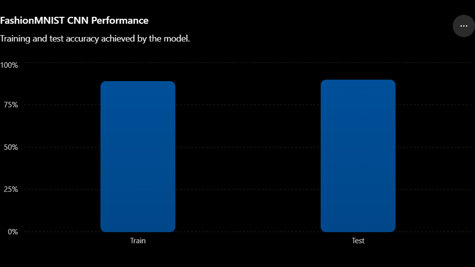

# FashionMNIST Image Classifier

# FashionMNIST Image Classifier


A Convolutional Neural Network (CNN) built with PyTorch to classify clothing items from the FashionMNIST dataset.

## Project Overview

This project demonstrates how deep learning can be used for image classification. The model is trained on the FashionMNIST dataset and predicts one of ten clothing categories from grayscale images.

## Dataset

FashionMNIST contains:

- 60,000 training images
- 10,000 testing images
- 10 classes
- 28×28 grayscale images

### Classes

- T-shirt/top
- Trouser
- Pullover
- Dress
- Coat
- Sandal
- Shirt
- Sneaker
- Bag
- Ankle boot

## Technologies Used

- Python
- PyTorch
- Torchvision
- NumPy
- Matplotlib
- Jupyter Notebook

## Project Structure

```text
fashion-mnist-classifier/
│
├── notebooks/
│   └── FashionMNIST_Classification.ipynb
│
├── src/
│   ├── vision_data.py
│   └── helper_functions.py
│
├── images/
├── results/
├── requirements.txt
└── README.md
```

## Project Workflow


The diagram below illustrates the complete pipeline from data loading and preprocessing through CNN training, evaluation, and prediction.

## Running the Project

Clone the repository:

```bash
git clone https://github.com/YOUR_USERNAME/fashion-mnist-classifier.git
```

Install dependencies:

```bash
pip install -r requirements.txt
```

Launch Jupyter Notebook:

```bash
jupyter notebook
```

Open:

```text
notebooks/FashionMNIST_Classification.ipynb
```

## Results

Model performance metrics and visualizations will be added here.


## Model Performance




## Results

The Convolutional Neural Network achieved the following performance on the FashionMNIST test set:

| Metric            | Value  |
| ----------------- | ------ |
| Training Loss     | 0.3088 |
| Training Accuracy | 88.78% |
| Test Loss         | 0.2853 |
| Test Accuracy     | 89.63% |

The model successfully learned meaningful visual features from FashionMNIST and generalized well to unseen test data.


### Key Takeaways

* Achieved nearly 90% classification accuracy.
* Demonstrated effective feature extraction using convolutional layers.
* Maintained similar training and testing performance, indicating limited overfitting.


## Future Improvements

- Data augmentation
- Hyperparameter tuning
- Model comparison experiments
- Model deployment using Streamlit

## Author

Your Name